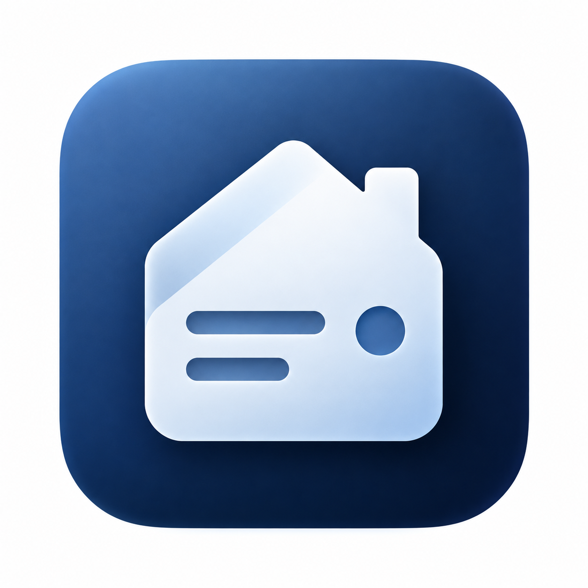

# Domiary

<p align="center">
  
</p>

<p align="center">
  <strong>Your home, remembered.</strong><br>
  Open-source mobile-first home and personal asset manager built on the 1C:Enterprise platform.
</p>

<p align="center">
  <a href="docs/PRD.md">PRD</a> ·
  <a href="docs/ARCHITECTURE.md">Architecture</a> ·
  <a href="docs/ROADMAP.md">Roadmap</a> ·
  <a href="CONTRIBUTING.md">Contributing</a> ·
  <a href="LICENSE">Apache 2.0</a>
</p>

---

## What is Domiary?

**Domiary** is a personal operating system for your home and property.

It is designed to help answer four everyday questions:

- **What do I own?**
- **What happened to it?**
- **What do I need to do next?**
- **What obligations and resources do I have?**

The project combines home inventory, maintenance, warranties, meters, recurring obligations and simple personal assets in one offline-first application.

Domiary is intentionally **not** a household ERP, accounting system or banking aggregator. The product should feel simple enough for everyday use while using the data-model strengths of 1C internally.

> Domiary = **dom + diary** — a long-term digital history of your home.

## Core idea

A home is more than a list of things.

Over time Domiary should remember:

- what you own and where it is;
- when an item was purchased;
- warranty periods and related documents;
- service and repair history;
- recurring maintenance;
- utility meter readings;
- upcoming household payments;
- savings goals and debts;
- what requires attention now.

The longer the app is used, the more useful its history becomes.

## Product principles

- **Useful first** — every feature must solve a real household problem.
- **Mobile-first** — the primary interface is the phone you already have near the asset.
- **Offline-first** — the core app must work without an account, server or internet connection.
- **Low friction** — adding an asset or task should take seconds, not minutes.
- **Action-oriented** — the home screen shows what needs attention rather than a database catalog.
- **History matters** — events accumulate into a useful digital history of the home.
- **AI reduces input** — AI should remove routine work, not become a feature added for its own sake.

## Planned v1

The first public version is planned around a deliberately constrained scope:

### Home & assets

- properties: house, apartment, cottage, garage;
- rooms and storage locations;
- assets and equipment;
- purchase price and basic asset information;
- photos and documents;
- warranty tracking;
- global search.

### Maintenance

- one-time and recurring tasks;
- maintenance schedules;
- local reminders;
- service history;
- automatic calculation of the next maintenance date.

### Home operations

- utility meters and readings;
- recurring household obligations;
- attention-focused dashboard;
- global timeline.

### Simple personal assets

- manually maintained accounts;
- savings goals;
- debts;
- planned major purchases.

### Data ownership

- local storage;
- backup and restore;
- export of key user data.

See the full [Product Requirements Document](docs/PRD.md).

## AI roadmap

AI is **not required for v1**. The application must remain useful without any AI service.

Later versions may add:

### Natural-language input

> “Remind me to change the boiler filter every six months. I changed it today.”

Domiary proposes the structured action and asks for confirmation.

### Ask My Home

Examples:

- When was the boiler last serviced?
- Which devices are still under warranty?
- What should I do before winter?
- What household payments are coming up?
- How much did we spend on the bathroom renovation?

The assistant should work through controlled application tools rather than direct access to the underlying database.

### Document Q&A

Questions over manuals and documents attached to a specific asset, with source-aware answers.

### Suggestions

The assistant may notice overdue or unusual maintenance and **suggest** actions. It must not silently change user data.

## Technology

Domiary is planned as a **mobile-first open-source application on the 1C:Enterprise 8.5 mobile platform**.

Current architectural direction:

- local-first / offline-first;
- no mandatory account;
- no mandatory server;
- domain-oriented internal architecture;
- explicit migrations and backups;
- automated tests for critical business logic;
- optional desktop client in a later phase.

The project also serves as a public reference implementation for modern product development on the 1C platform, including agentic development workflows and future controlled AI tool-calling.

## Project status

**Early design / pre-development.**

The current repository contains the product specification, the initial architecture draft and the visual identity. Resolving the open architecture decisions and starting implementation are the next milestones.

Progress is tracked in the [roadmap](docs/ROADMAP.md).

## Project guardrail

> **Do not build a household ERP.**

Internally, Domiary can use catalogs, documents, registers and other strengths of the 1C platform.

The user should see:

- What Needs Attention
- My Things
- What To Do
- Payments
- Savings
- History

—not accounting or ERP terminology.

## Repository structure

```text
.
├── docs/
│   ├── ARCHITECTURE.md
│   ├── PRD.md
│   └── ROADMAP.md
├── icon.png
├── CONTRIBUTING.md
├── LICENSE
└── README.md
```

The structure will evolve once implementation begins.

## Contributing

Domiary is currently in the product-design stage. Ideas, use cases and technical discussions are welcome.

Before submitting implementation work, please read [CONTRIBUTING.md](CONTRIBUTING.md).

## Website

**domiary.ru** — reserved for the project; public website is planned later.

## License

Domiary is licensed under the [Apache License 2.0](LICENSE).
